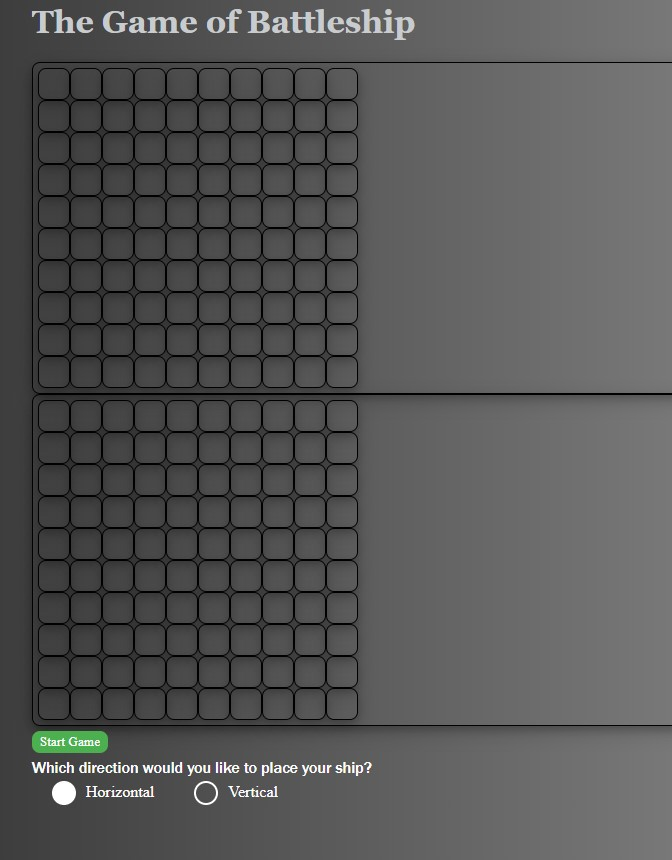
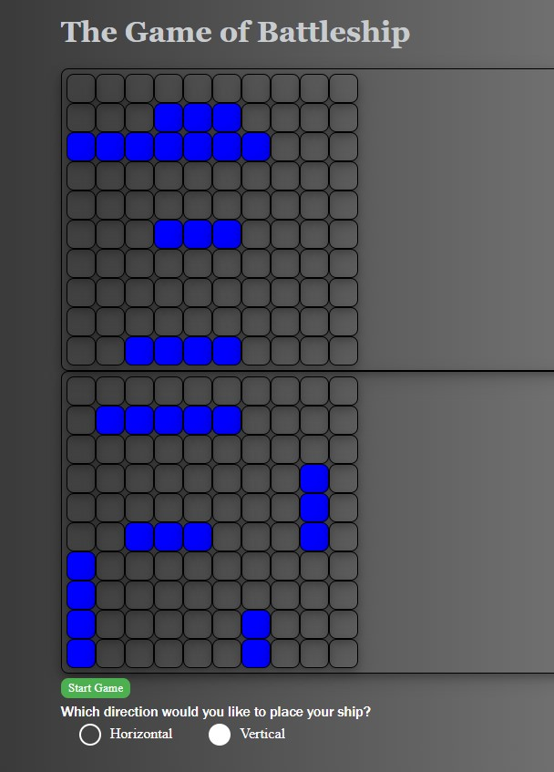
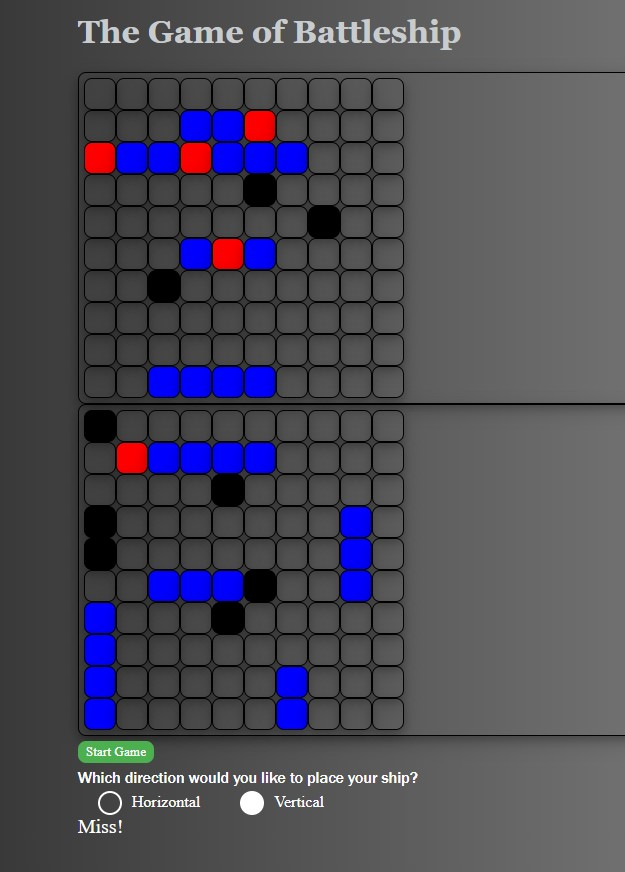
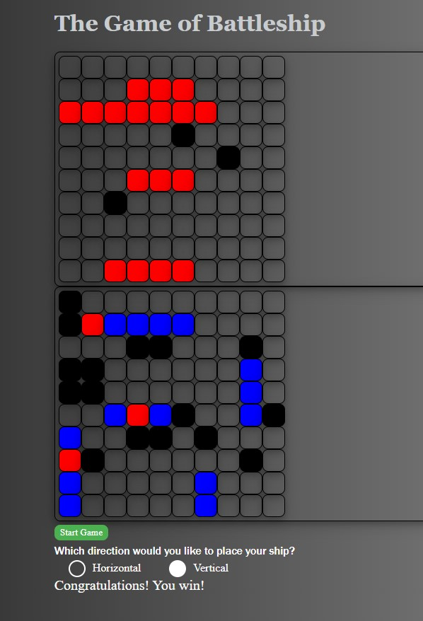

# Battleship
- Battleship is a two-player strategy/guessing game where the object is to sink all of your opponents ships.
- Ships are placed on a 10x10 grid and players take turns "attacking" each other by guessing a coordinate.
> For demonstration purposes the AI's ships are visible in these screenshots and in the MVP game, after demonstrating the game I will be adjusting the code so that the AI's ships are invisible

## Initial Game State

## Ships are placed after start game is pressed

## Game in progress

> hits are denoted by red and misses are denoted by black

## Game complete

> at the end of the game, the result is displayed below and the Start Game button will restart a new game

# Technology Used
The following technology was used to create this battleship game:
- HTML
- CSS
- JavaScript

# Getting Started
Game can be played at this [link](https://timmmartinson.github.io/Battleship-Project/)
Instructions:
- Click on start game, this will place the ai's ships.
- Select whether you would like to place your ship horizontally or vertically.
- Click on the lower grid to place your five ships.
    - ships are placed in order from largest to smallest (5 length, 4 length, two 3 length, and 2 length)
    - If you select "Horizontal" the ship will place from left to right.
    - If you select "Vertical" the ship will place from top to bottom.
    - If you attempt to place a ship where it won't fit, you will be alerted and have to try again.
- Click on the cells in the top grid to attack
    - The result of "Hit" or "Miss" will display below, hits will turn red and misses will turn black.
- The AI attacks after you
    - As the game progresses, the ai can take longer to find a legal attack
- Once the game is over you can click the Start Game button to start a new game.
# Next Steps
## Version 2
- As a user, I want a container that shows the hits on each ship
- As a user, I want an end of game screen that shows where both players placed all of their boats
- As a user, I want to keep track of my wins and losses
- As a user, I want my cursor to look like a missile when I am hovering to attack.
- As a user, I want labeled coordinates

## Version 3
- As a user, I want to be able to drag and drop my ships to place them.
- As a user, I want customizable ship appearances.
- As a user, I want access to different board backgrounds
- As a user, I want sound effects.
- As a user, I want different types of boats
- As a user, I want better, non-random AI.